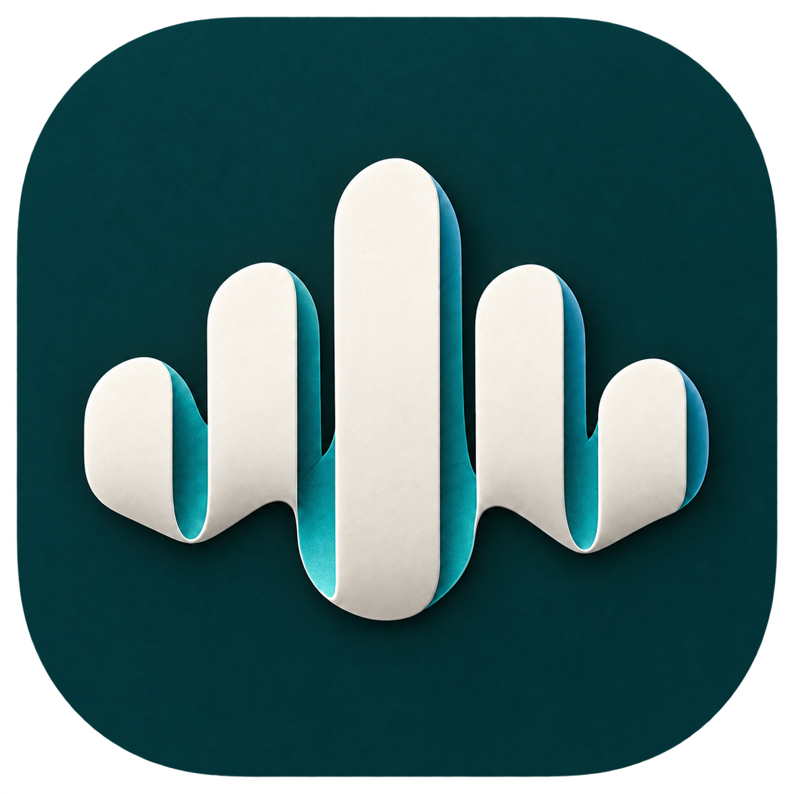

<p align="center">
  
</p>

<h1 align="center">yovoice</h1>
<p align="center">Give your words a voice.</p>
<p align="center">
  <a href="web/package.json"></a>
  <a href="LICENSE"></a>
  
  
</p>
<p align="center">English · <a href="README_zh.md">简体中文</a></p>

---

yovoice is an open-source voice creation tool for macOS and Windows that turns text into natural, expressive speech locally. With voice cloning, emotion control, audio project management, and a choice of TTS models, it requires no cloud API calls and incurs no per-character charges, giving you more control over narration, voiceovers, and audio content creation at a lower cost.


---

## Features

- **Voice and expression** — use a reference voice, match a reference performance, adjust emotions, or describe the delivery in words.
- **A complete audio workflow** — import or record reference audio, trim clips, preview speech, and export your work.
- **Voice design and cloning** — VoxCPM2 offers text-guided voice design, controllable cloning, and transcript-assisted cloning with automatic multilingual handling, and 48 kHz output.
- **Local models** — run IndexTTS 2.0 / 2.5, VoxCPM2, OmniVoice and Qwen3-TTS through audio.cpp, with resumable model downloads and GGUF import.
- **Hardware acceleration** — Metal on Apple Silicon; CPU, NVIDIA CUDA, and experimental Vulkan on Windows.
- **Agent Skill** — ask your AI agent to set up local speech generation and create voiceovers from text and reference audio.

---

## Supported Models

| Model | Core capabilities |
| --- | --- |
| IndexTTS 2.0 | Chinese/English voice cloning, emotion control, reference performance |
| IndexTTS 2.5 | Multilingual voice cloning, emotion control, pronunciation editing |
| VoxCPM2 | Text-guided voice design, voice cloning, transcript-assisted cloning |
| OmniVoice | Attribute-based voice design, voice cloning, non-verbal sound tags |
| Qwen3-TTS Base · 0.6B / 1.7B | Reference voice cloning, optional transcript guidance, multilingual speech |
| Qwen3-TTS CustomVoice · 1.7B | 9 built-in voices, text-guided style and emotion |
| Qwen3-TTS VoiceDesign · 1.7B | Voice design from natural-language descriptions, no reference audio required |

All models are available in the App and CLI. See [model capabilities](skills/yovoice/references/models.md) for precisions and parameters. OmniVoice weights use the CC-BY-NC license and are restricted to non-commercial use.

---

## Installation

Choose the package for your platform from the repository’s [Releases](../../releases) tab.

| Platform | Package | Install |
| --- | --- | --- |
| macOS 14+ · Apple Silicon | `.dmg` | Open the disk image and drag yovoice to Applications |
| Windows 10/11 · x64 | `-setup.exe` | Run the installer, then open yovoice from the Start menu |

The Windows installer downloads and installs [WebView2 Runtime](https://developer.microsoft.com/microsoft-edge/webview2/) if needed. Models are downloaded inside the app; uninstalling preserves user data in `~/.yovoice`.

Check for updates from the app menu on macOS or Windows. Updates are also checked and downloaded in the background; restart to install when ready.


---

## Quick Start

1. **Set up a model.** Open Settings and download your chosen model. The CPU engine is bundled on Windows; CUDA can be downloaded from Settings for NVIDIA GPU acceleration.
2. **Prepare a character.** Create a character in the sound library, or import or record a 1–60 second clip under Reference audio. Preview recordings before saving.
3. **Create a project.** Choose Story dubbing or Speech generation from New project, or create directly from either project list. Stories support multiple speakers and subtitle imports; speech projects generate a single passage.
4. **Listen and manage.** Edit story audio as individual timeline clips. Open History versions from a speech project's card menu to manage that project's results. Selecting an older version only changes playback, leaving the text and settings intact.

Both project lists support search, opening the entire card, renaming, duplication and deletion. The sound library groups reusable characters and reference audio. Character edits are explicitly saved; applying a character requires a target project and speaker, and later library edits do not alter existing projects. The task status entry shows the current generation or download. See the [product and interaction specification](docs/product-ux.md) for implemented scope and future requirements.

Stories support SRT, VTT and ASS/SSA imports. Selecting a file creates a new story directly; cancelling creates nothing. WebVTT voice tags and ASS/SSA Name/Actor fields identify speakers; unmarked dialogue shares one speaker. Add or name speakers, reassign individual cues and map speakers to library characters. Settings are captured when selected; select the character again to refresh them. Select a line to edit its speaker's settings in the inspector; changes apply to every line by that speaker. Click below the last line to append a cue using the previous speaker. Enter splits a cue, Shift+Enter inserts a line break, and Backspace or Delete removes an empty cue. Empty cues are saved but skipped during generation.

Imports accept UTF-8 and BOM-marked UTF-16, up to 2 MB, 2000 cues, 100 speakers and 12000 characters. Each cue is generated using its speaker's settings, saved as a separate audio file and placed on the timeline in dialogue order. Original subtitle timing is not matched. Completed clips survive cancellation or a later cue failing.

Use **Add track** to add a lane and its **Audio** menu to upload audio. Speech projects can also import one of their own previous versions. Select a clip and position the playhead to split it; drag clips or edit their start times to move them. Mute individual tracks during mixed playback and drag the top edge to resize the timeline. Edits are saved with the project and preserve source audio. Each clip has editable source in/out points. Regenerating a clip uses its current dialogue and speaker settings, resets its trim and shifts later clips on the same track by the duration difference. Removing a clip preserves its dialogue and source file. Generating the whole project again creates another track, initially muted when playable tracks already exist.

**Export timeline** merges the unmuted clips with their current trims, positions, gaps and overlaps into 24 kHz mono WAV. Offline export currently supports up to one hour. macOS and Windows use a native save dialog; browser preview downloads the file. Export leaves the editable project intact.

Projects, voices, and settings are saved in `~/.yovoice`.

---

## CLI & Agent Skill

Give your agent the [yovoice Skill](https://github.com/leemysw/yovoice/tree/main/skills/yovoice) link and ask it to install the Skill and set up the local CLI, engine, and model:

> Install this Skill and set up yovoice for local speech generation: https://github.com/leemysw/yovoice/tree/main/skills/yovoice

Then describe what you want:

> Read narration.txt using voice.wav as the reference voice, with a calm delivery, and save it as narration.wav.

The agent runs the standalone CLI without opening the desktop app. See the [CLI guide](docs/cli.md) for details.

---

## Development

```sh
make install
make app-run
```

See the [development guide](docs/development.md) for prerequisites. It also covers browser preview, tests, and project structure.

---

## Contributing

Bug reports, feature suggestions, and pull requests are welcome. Include your platform, model, and steps to reproduce when reporting a problem. Run `make check` before submitting code changes.

---

## Acknowledgements

- [audio.cpp](https://github.com/0xShug0/audio.cpp) by ShugoAI — the local audio inference engine.
- [VoxCPM](https://github.com/OpenBMB/VoxCPM) — voice design and cloning models, licensed under Apache-2.0.
- [IndexTTS](https://github.com/index-tts/index-tts) — the speech synthesis models behind yovoice.
- [OmniVoice](https://github.com/k2-fsa/OmniVoice) — voice design and cloning models.
- [Qwen3-TTS](https://github.com/QwenLM/Qwen3-TTS) — voice cloning, built-in voices, and text-guided voice design.
- Kokoro — lightweight speech synthesis with built-in voices: [Kokoro-82M](https://huggingface.co/hexgrad/Kokoro-82M) and [Kokoro-82M-v1.1-zh](https://huggingface.co/hexgrad/Kokoro-82M-v1.1-zh).

---

## License

[Apache-2.0](LICENSE). Dependencies retain their [original licenses](THIRD_PARTY_NOTICES.md); IndexTTS models are covered separately by their [model license](web/public/model-license.txt).
